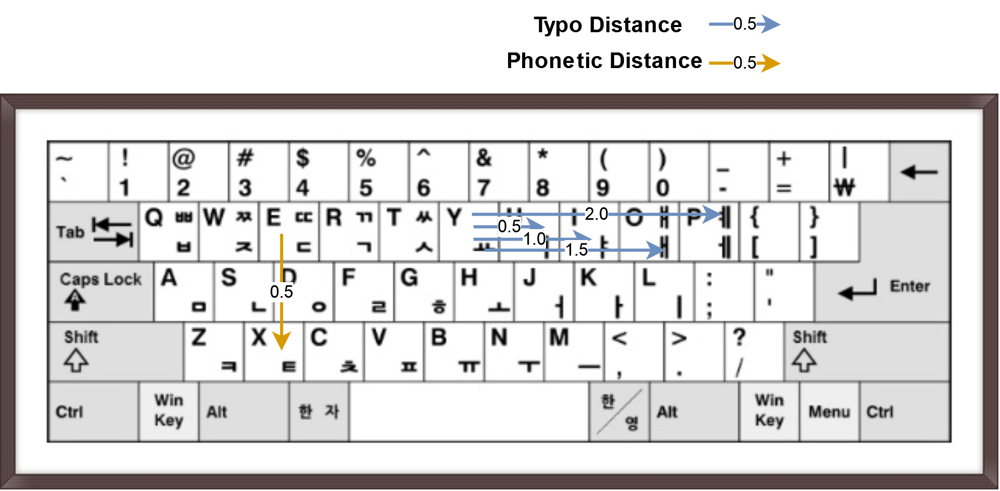

# HDKU

Hangul Dubeolsik(QWERTY) Keystroke Utils

The [Dubeolsik(QWERTY) keyboard](https://en.wikipedia.org/wiki/Keyboard_layout#Dubeolsik) is the most used Korean keyboard layout in mobile and desktop environments. When calculating the distance of a Hangul character string, the distance calculation considering the Jamo constituting the Korean syllable and the characteristics of the Hangul keyboard is an essential part to be considered in various applications (eg, typographical correction). 'HDKU' is a package that calculates the distance of Hangul words based on a Dubeolsik keyboard and Hangul phonetics with Hangul-related conversion tools.

The distance is largely based on typo distance and Hangul phonetic distance as shown below. See [here](hdku/ko_levenstein_distance.py) for more details.



For example, consider the following two sentence pairs:

```python
from hdku import KoDubeolsikDistance
kdd = KoDubeolsikDistance()
kdd.get_distance("안녕하세요", "안녕하셔요")
# 1.5
kdd.get_distance("안녕하세요", "안녕하새요")
# 0.5
```

All three sentences above mean `greetings`, but only '안녕하새요' contains a grammatical error.
When calculated with HDKU, the probability of a typo between 'ㅔ <-> ㅐ' is higher than that of 'ㅔ <-> ㅕ', ​​and the distance is judged closer, which is very common sense.

`HDKU` provides the following features.

- Typo distance and phonetic distances based on Dubeolsik keyboard
- Hangul Jamo sequences <-> Hangul sentence(using Hangul automata)

## Install

```bash
pip install git+https:/github.com/haven-jeon/HDKU.git
```

## Functions

```python
from hdku import KoDubeolsikDistance, Hangul, JamoAutomata
h = Hangul()
auto = JamoAutomata()

h.convert_hangul_to_jamos("아버지가 방에 들어가신다.")
# 'ㅇㅏㅂㅓㅈㅣㄱㅏ ㅂㅏㅇㅇㅔ ㄷㅡㄹㅇㅓㄱㅏㅅㅣㄴㄷㅏ.'
auto.convert('ㅇㅏㅂㅓㅈㅣㄱㅏ ㅂㅏㅇㅇㅔ ㄷㅡㄹㅇㅓㄱㅏㅅㅣㄴㄷㅏ')
# '아버지가 방에 들어가신다'

# with no automata : reformulate with syllable divider '｜'  
jamos = h.convert_hangul_to_jamos("아버지가 방에 들어가신다.", True)
for jamo in jamos.split(h.DIVIDER):
    print(h.convert_jamos_to_syllable(jamo), end='')
# '아버지가 방에 들어가신다'


kdd = KoDubeolsikDistance()
kdd.get_distance('아버지가 방에 들어가신다.', '아버지가 집에 들어가신다.')
# 2.5
kdd.get_distance('아버지가 방에 들어가신다.', '아버지가 밭에 들어가신다.')
# 0.5
```
